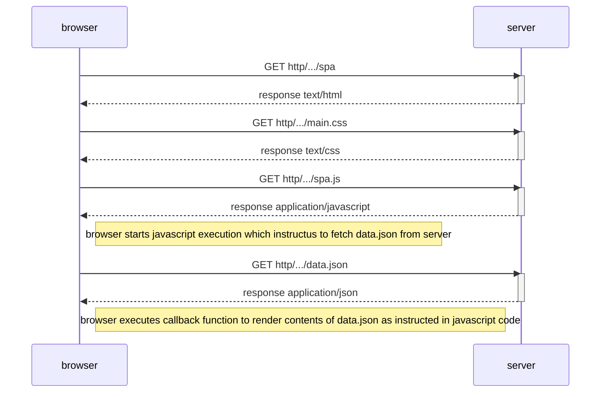

```mermaid

sequenceDiagram
    participant browser
    participant server

    browser ->> server: GET http/.../spa
    activate server
    server -->> browser: response text/html
    deactivate server

    browser ->> server: GET http/.../main.css
    activate server
    server -->> browser: response text/css
    deactivate server

    browser ->> server: GET http/.../spa.js
    activate server
    server -->> browser: response application/javascript
    deactivate server

    Note right of browser: browser starts javascript execution which instructus to fetch data.json from server

    browser ->> server: GET http/.../data.json
    activate server
    server -->> browser: response application/json
    deactivate server    

    Note left of server: browser executes callback function to render contents of data.json as instructed in javascript code

```